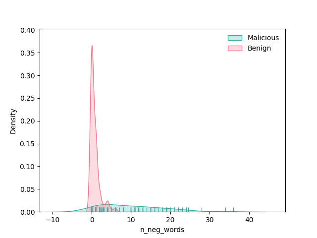

# Prompt Analysis

    
    

## Introduction

The purpose of this analysis is to find a simple method for detecting malicious prompts that are fed into LLMs. The usage for this would be as a validation tool within an LLM API where prompts are received, analysed by the tool and remediation steps taken based on the probability of it being malicious.

### Data

The insights here should be taken with huge pinch of salt, the data hasn't been well curated, it was just whatever I could get my hands on. However hopefully it will provide some ideas for further analysis.

###### data/jailbreak_prompts.csv
This data was scraped from https://jailbreakchat.com on 25/10/2023 and contains a small collection of prompts that attempt to bypass LLM security measures. I'm using these as my sample of malicious prompts.

###### data/chatgpt_prompts.csv
This data was downloaded from kaggle \(link: https://www.kaggle.com/datasets/shivanshuman/amazing-prompts\) and contains a sample of prompt examples. I'm using these as my sample of benign prompts.

### Theory

My initial thought is that the sentiment of malicious prompts will usually be more negative than the benign prompts. This combined with some behavioural data (maybe recently created accounts or certain email domains are more likely to input malicious prompts) will help us separate malicious from benign.

##### Analysis

First I looked at the sentiment of entire prompts and then looked at the distribution of the scores for each of negative, neutral and positive. The neutral and positive are very similar across classes however the negative sentiment does have a bit more variation within the malicious class and a higher mean negative score. However it wasn't by a tremendous margin.

It's encouraging but I'd also like to look at the occurence of negative words. I'm thinking that the whole prompt doesn't have to be negative, but I want to identify prompts that might be specifying negative things that they hope to talk about/bypass.

Looking at the distribution of the number of negative words within a prompt seems to be a bit of a stronger separator between the two classes. 

*modelling of the count data to follow*
